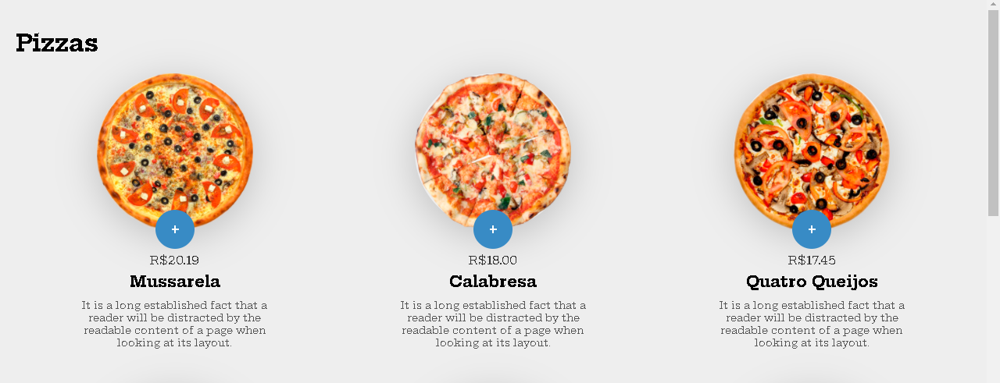
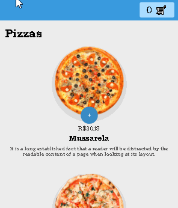

# Projeto: Sistema de pizzaria

 

 ## Versão mobile
 

 

# Descrição

Sistema de pizzaria, responsivo, feito com CSS e Javascript. Projeto de front end, para fixar conhecimentos de manipulação do DOM.

# Tecnologias Utilizadas

Front-end

1. HTML/CSS
2. Javascript

# Licença

:book: Licença MIT. Veja o arquivo LICENSE.